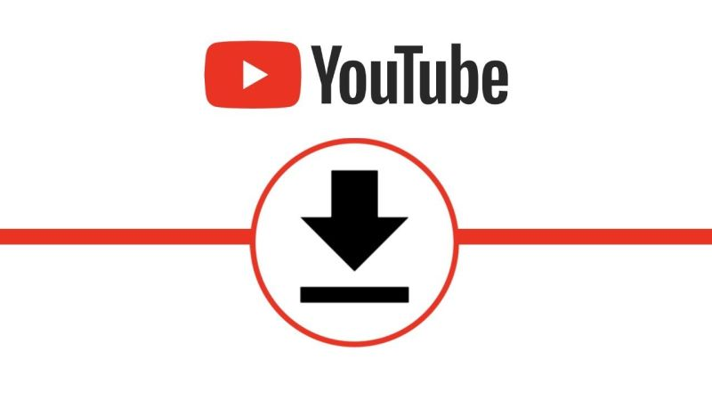

# Youtube Download
## Script para baixar videos e playlist
 

## Funcionalidades

- [x] Baixa qualquer video do yt
- [x] Baixa videos a partir de playlist
- [x] Voçê escolhe o formato do arquivo (mp4, mp3)
- [ ] Adcionar uma interface gráfica

### Requirementos
  <pre>Python3.8+ Pytube</pre>

### Modo de usar
Com o terminal aberto digite:
<pre>git clone https://github.com/fl1pe/YoutubeDownload.git</pre>
Dentro da pasta clonada, digite:
<pre>pip install -r requirements.txt</pre>
Execute o arquivo principal
<pre>python3 src/app.py</pre>

